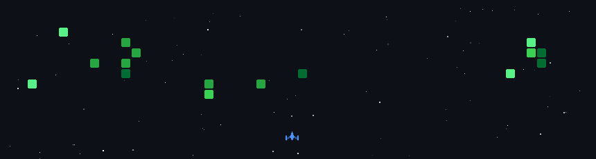

# 💫 About Me:
Name: Ankit Kumar Singh Phone: +91 9315836405 Email: ankits8391@gmail.com LinkedIn: linkedin.com/in/ankit-kumar-singh-647401282 GitHub: github.com/ankitshishodiya83  Education: B.Tech in Computer Science, Amity University, Patna (2022–2026)  with hands-on training and certification in SAP ABAP Cloud. Skilled in ABAP Dictionary, Open SQL, Reports, Internal Tables, RAP, and S/4HANA Extensibility, with practical experience developing ABAP programs and applications. Also trained in Tricentis Tosca Automation, including Test Case Design and XScan Control Recognition.  Certified as an SAP Certified Back-end Developer – ABAP Cloud, with additional experience in Python, AI/Data Science, Java, web technologies, and software engineering projects. Strong interest in starting a career as an SAP ABAP Developer/Fresher, bringing a combination of SAP development knowledge, programming skills, and hands-on project experience.

## 🌐 Socials:
    

# 💻 Tech Stack:
                                      
# 📊 GitHub Stats:
 
 

## 🏆 GitHub Trophies

### ✍️ Random Dev Quote

### 🔝 Top Contributed Repo

---

<!-- Proudly created with GPRM ( https://gprm.itsvg.in ) -->
## 🚀 GitHub Space Shooter

  

